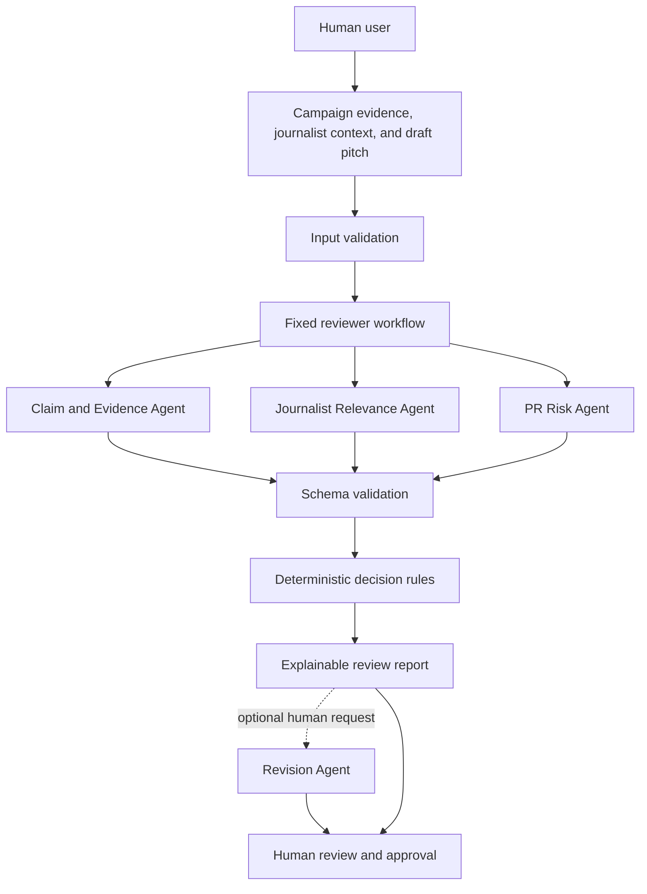

# PitchGuard

PitchGuard is an AI-assisted quality gate that reviews PR pitches before they are sent to journalists, detecting poor targeting, unsupported claims, weak personalization, inappropriate language, and potential reputational risks.

> **Current status:** The local development scaffold, validated data and configuration models, versioned prompts, provider-independent Ollama integration, three independent pitch reviewers, fixed concurrent workflow, deterministic decision rules, main review API endpoint, manual-input review interface, and three fictional deterministic evaluation cases are **Implemented**. Live-model evaluation and the optional Revision Agent remain unfinished. Unless explicitly marked **Implemented**, the capabilities described below are intended behavior rather than completed functionality.

## Overview

PitchGuard is intended to help public relations professionals inspect a draft pitch before sending it. It will compare the pitch with user-supplied campaign evidence and journalist information, run several focused AI reviews, validate their structured responses, and use deterministic application rules to produce a `PASS`, `REVISE`, or `BLOCK` recommendation.

PitchGuard is a decision-support system. It will not send messages automatically, and its output will not guarantee that a pitch is correct, safe, or suitable. A human remains responsible for reviewing the findings and deciding whether to use the pitch.

## Problem

AI can make PR drafting faster, but fluent text can still contain serious problems:

- unsupported, exaggerated, or contradicted claims;
- incorrect statistics, rankings, or comparisons;
- weak journalist targeting or generic personalization;
- overly promotional, manipulative, or spam-like language;
- unclear calls to action;
- confidential, sensitive, defamatory, or reputationally risky content; and
- statements that appear credible but are not supported by the evidence supplied for the campaign.

Sending a poor pitch can damage the relationship between a PR professional and a journalist and can harm the reputation of the agency or client.

## Solution

The proposed workflow accepts five inputs:

1. A campaign or company brief
2. Supporting evidence or verified facts
3. A journalist profile
4. Examples of the journalist's recent coverage
5. The proposed PR pitch

Specialized AI agents will examine different risk areas. Their outputs will use defined JSON schemas and will be validated before the application relies on them. Normal application code—not an LLM acting alone—will combine the validated findings and apply the final decision rules.

The intended report includes:

- an overall `PASS`, `REVISE`, or `BLOCK` decision;
- journalist relevance and personalization scores;
- supported, unsupported, contradicted, and unclear claims;
- tone, language, confidentiality, and reputational warnings;
- a human-readable reason for each important finding;
- recommended actions; and
- optionally, a revised pitch limited to verified information.

## Demo and screenshots

**Implemented** — The local frontend provides the manual review form and renders complete or partial API reports. No repository screenshot or deployed demo is available yet.

Deployment status: not deployed; deployment is outside the MVP scaffold scope.

## How it works

The proposed MVP user flow is:

1. The user opens the application.
2. The user enters a campaign brief and supporting facts.
3. The user enters a journalist profile and examples of recent coverage.
4. The user pastes the draft pitch.
5. The user starts the review.
6. The application shows the progress or status of each agent.
7. The application displays the final decision.
8. The user expands each section to inspect evidence, relevance, and risk findings.
9. If available, the user requests a revised pitch.
10. The user manually decides whether to use the result.

## Agent responsibilities

The first three reviewers are **Implemented** as independent backend components. Each sends only its required input through the provider interface, returns a validated Pydantic model, and applies deterministic semantic checks. Their fixed concurrent workflow, deterministic decision engine, and API integration are also **Implemented**.

### 1. Claim and Evidence Agent — **Implemented**

This reviewer:

- extract factual and measurable claims from the pitch;
- identify statistics, rankings, comparisons, performance claims, and market-leadership claims;
- compare each claim with the supplied campaign brief and evidence;
- classify each claim as `SUPPORTED`, `UNSUPPORTED`, `CONTRADICTED`, or `UNCLEAR`;
- explain the classification; and
- reference the supplied evidence when it is available.

The agent must never use general model knowledge as proof that a campaign claim is correct.

For example, if a pitch says, “Our customers save 40% of their working time,” while the supplied evidence reports a 22% reduction in time spent on administrative tasks, the agent should identify changes in both the percentage and scope. It should classify the claim as `CONTRADICTED` and explain why the change is materially misleading rather than treating the statements as equivalent.

### 2. Journalist Relevance Agent — **Implemented**

This reviewer:

- compare the campaign subject with the journalist's stated beat;
- examine the supplied examples of recent coverage;
- determine whether the journalist appears to be an appropriate target;
- check whether the pitch meaningfully references the journalist's work;
- detect generic or superficial personalization; and
- return a relevance score from 0 to 100, a personalization score from 0 to 100, a short explanation, and specific mismatch warnings.

It must not assume facts about the journalist that the user did not supply.

### 3. PR Risk Agent — **Implemented**

This reviewer:

- detect exaggerated and overly promotional language;
- identify unsupported superlatives such as “best,” “first,” “fastest-growing,” and “revolutionary”;
- detect misleading certainty or unrealistic promises;
- identify aggressive, manipulative, or spam-like language;
- check for a clear and reasonable call to action; and
- flag potentially confidential, sensitive, defamatory, or reputationally dangerous content.

Each finding will be classified as `LOW`, `MEDIUM`, `HIGH`, or `CRITICAL`. The agent provides analysis but does not choose the final decision.

### 4. Revision Agent — **Optional stretch goal**

If implemented, this agent will:

- rewrite the pitch using findings from the other agents;
- use only facts supported by the campaign brief and supplied evidence;
- remove or qualify unsupported statements;
- improve relevance and personalization without inventing details;
- preserve the main intention of the original pitch;
- avoid adding new names, numbers, claims, quotations, or facts; and
- label its output as requiring human approval.

## System architecture

The internal reviewer workflow is **Implemented**. It coordinates the three fixed reviewers concurrently, applies bounded per-attempt timeouts and retries, preserves partial successes, and returns structured errors. The deterministic decision engine is also **Implemented** and refuses incomplete workflows. The API assembles validated complete or partial reports, and the frontend renders both states without inventing a decision.



The intended orchestration sequence is:

1. Validate the user's input.
2. Run the appropriate agents.
3. Validate every response against a defined schema.
4. Treat malformed, incomplete, or timed-out responses as review failures—not as evidence that a pitch is safe.
5. Combine the validated findings.
6. Apply deterministic decision rules in application code.
7. Generate an explainable final report.

## Decision and guardrail logic

**Implemented** — The final decision is calculated by synchronous Python code. No AI agent selects or overrides it.

The initial proposed rules, in precedence order, are:

- `BLOCK` when a high-risk factual claim is contradicted.
- `BLOCK` when a critical reputational or confidentiality risk is detected.
- `BLOCK` when journalist relevance is below 40.
- `REVISE` when an important claim is unsupported.
- `REVISE` when relevance is from 40 through 69.
- `REVISE` when personalization is below 60.
- `REVISE` when a medium-severity tone or language issue is detected.
- `PASS` only when no blocking or revision condition exists and all configured quality thresholds are satisfied.

The implemented default thresholds are 40 for blocking relevance, 70 for acceptable relevance, and 60 for acceptable personalization. They are held in an injectable application policy rather than embedded in prompts.

The design is guided by six guardrails:

- **Human-in-the-loop:** PitchGuard advises; a person makes the final sending decision.
- **Structured AI output:** Every agent response must be JSON validated against an explicit schema before use.
- **Deterministic guardrails:** LLMs identify and explain possible issues; application code determines the outcome.
- **Evidence-bounded generation:** Supplied evidence must remain distinguishable from unverified text, and revisions must not introduce absent facts.
- **Fail safely:** Invalid JSON, missing fields, timeouts, and incomplete reviews must never silently produce `PASS`.
- **Explainability:** Important warnings and decisions must include reasons a reviewer can inspect.

## Technology stack

| Area | Current choice | Status |
| --- | --- | --- |
| Frontend | Next.js 16, React 19, TypeScript, Tailwind CSS 4 | **Implemented** manual-input form and report |
| Backend | Python 3.14, FastAPI, Pydantic, Pydantic Settings | **Implemented** scaffold |
| Local server | Uvicorn | **Implemented** for local API serving |
| AI provider | Official Ollama client behind a structured-generation interface | **Implemented** provider and independent reviewer layers |
| Backend tests | `pytest`, HTTPX, and HTTPX2 | **Implemented** for health, configuration, schemas, prompts, providers, reviewers, workflow, decision rules, and the review API |
| Frontend tests | Vitest, React Testing Library, and `user-event` | **Implemented** focused component tests |
| Code quality | Ruff, ESLint, and TypeScript validation | **Implemented** |
| Git hooks | Pre-commit hooks | **Optional stretch goal** |
| CI | GitHub Actions for linting, tests, type checking, and build verification | **Implemented** configuration |
| Packaging | Docker | **Planned** |
| Deployment | None for the MVP | **Implemented** scope decision |
| Infrastructure as code | Terraform | **Optional stretch goal** |
| Storage | No database or persistent analysis storage for the MVP | **Implemented** scope decision |

The manifests deliberately keep the scaffold small. Uvicorn serves the ASGI application; HTTPX and HTTPX2 support provider and API tests; Pydantic Settings validates configuration; and the official Ollama client supports structured local generation. Exact resolved versions are recorded in `backend/uv.lock` and `frontend/package-lock.json`.

The selected Ollama model and endpoint are configured through environment variables. The MVP does not require a cloud AI API key, and no real secret or API key should ever be committed to this repository.

## Current implementation status

| Capability | Status | Repository evidence |
| --- | --- | --- |
| Project concept, provisional PRD, and development rules | **Implemented** | `README.md`, `docs/`, and `AGENTS.md` |
| Minimal under-development page | **Implemented** | `frontend/src/app/page.tsx` |
| Manual product inputs and report UI | **Implemented** | `frontend/src/components/` |
| Fictional manual test scenarios | **Implemented** | `manual-test-scenarios/` |
| API health endpoint and typed response | **Implemented** | `GET /api/health` in `backend/app/main.py` |
| Main product review API | **Implemented** | `POST /api/v1/reviews` in `backend/app/api/routes/reviews.py` |
| Claim and Evidence Agent | **Implemented** | `backend/app/reviewers/evidence.py` |
| Journalist Relevance Agent | **Implemented** | `backend/app/reviewers/relevance.py` |
| PR Risk Agent | **Implemented** | `backend/app/reviewers/risk.py` |
| Fixed concurrent reviewer workflow | **Implemented** | `backend/app/workflow/` |
| Review input, reviewer-output, error, and final-response schemas | **Implemented** | `backend/app/schemas.py` |
| Structured-generation provider and Ollama implementation | **Implemented** | `backend/app/providers/` |
| Deterministic decision engine | **Implemented** | `backend/app/decision/` |
| Validated final report API response | **Implemented** | Complete results return `200`; safe partial results return `503` |
| Health endpoint test | **Implemented** | `backend/tests/test_health.py` |
| Schema validation tests | **Implemented** | `backend/tests/test_schemas.py` |
| Decision tests | **Implemented** | `backend/tests/decision/` |
| Fictional deterministic evaluation cases | **Implemented** | `backend/tests/fixtures/evaluation/` and `backend/tests/evaluation/` |
| Live Ollama evaluation | **Planned** | No recorded live-model results are present |
| Revision Agent | **Optional stretch goal** | No agent implementation is present |
| Continuous integration | **Implemented** configuration | `.github/workflows/ci.yml` |
| Deployment | **Planned** | No deployment configuration is present |

## Getting started

### Prerequisites

- Python 3.14
- [uv](https://docs.astral.sh/uv/) for Python dependency management
- Node.js 24 and npm
- Ollama is not required for normal development checks or unit tests. It is required only for the skipped-by-default local integration test and live reviewer execution.

Install the locked dependencies from the repository root:

```bash
cd backend
uv sync --locked --dev

cd ../frontend
npm ci
```

## Environment variables

The repository contains safe example files only. Copy them to local `.env` files when configuration is needed; never commit the resulting files.

`backend/.env.example`:

```env
APP_ENV=development
OLLAMA_BASE_URL=http://localhost:11434
OLLAMA_MODEL=qwen3:8b
OLLAMA_TIMEOUT_SECONDS=120
CORS_ORIGINS=["http://localhost:3000"]
```

`frontend/.env.example`:

```env
NEXT_PUBLIC_API_BASE_URL=http://localhost:8000
```

The backend and frontend load and validate these values. A local `.env` file is optional because the current settings have safe development defaults.

### Local Ollama setup

Install the default model before running a review:

```bash
ollama pull qwen3:8b
ollama list
```

On CPU-only hardware, three concurrent `qwen3:8b` reviews may exceed the current timeout. A smaller local model can be used for development:

```bash
ollama pull qwen3:4b
```

Copy `backend/.env.example` to `backend/.env`, change `OLLAMA_MODEL` to `qwen3:4b`, and restart the backend. The smaller model is expected to run faster, but its PitchGuard quality has not yet been evaluated.

## Running the application

Start the API from one terminal:

```bash
cd backend
uv run uvicorn app.main:app --reload
```

The health endpoint will be available at `http://localhost:8000/api/health`.

Start the frontend from a second terminal:

```bash
cd frontend
npm run dev
```

The minimal under-development page will be available at `http://localhost:3000`.

## Running tests and checks

Run the backend checks:

```bash
cd backend
uv run ruff check .
uv run ruff format --check .
uv run pytest
```

Run the frontend checks:

```bash
cd frontend
npm run test
npm run lint
npm run typecheck
npm run build
```

The GitHub Actions workflow runs the same checks for pushes to `main` and pull requests.

## Evaluation approach

The project will need to test both deterministic application behavior and the less predictable behavior of AI models.

### Deterministic tests — **Implemented** for the current workflow

The current automated suite covers schema boundaries, structured provider behavior, the three reviewers, workflow failures and retries, deterministic decision rules, API response mapping, application lifecycle, and three fictional end-to-end evaluation cases without requiring a live model. The evaluation cases validate `PASS`, `REVISE`, and `BLOCK` paths through the real reviewers, workflow, and decision engine while returning fixture responses through fake providers. The Revision Agent safety check remains unavailable because that optional agent is not implemented.

The critical rule suite should verify that:

- a contradicted high-risk claim results in `BLOCK`;
- a relevance score below the configured threshold results in `BLOCK`;
- an unsupported important claim results in `REVISE`;
- a safe, relevant, well-supported pitch can result in `PASS`;
- invalid agent JSON is rejected;
- missing required fields are handled safely;
- an AI provider timeout does not result in `PASS`; and
- the Revision Agent cannot silently introduce unsupported claims.

Run only the deterministic evaluation cases with:

```bash
cd backend
uv run pytest tests/evaluation
```

### Fictional evaluation fixtures — **Implemented**

The current versioned dataset contains three concise cases:

- a relevant, well-supported pitch expected to `PASS`;
- a partially relevant pitch with an unsupported claim and actionable language risk expected to require `REVISE`; and
- a pitch with a contradicted high-importance claim and confidential information expected to `BLOCK`.

Each JSON fixture contains a validated request, mocked outputs for all three reviewers, the expected deterministic decision and reason codes, and stable score or category expectations. All names, organizations, claims, and URLs are fictional.

Future evaluation coverage may add:

- a pitch sent to the wrong journalist;
- a pitch with an invented statistic;
- a pitch that exaggerates supplied evidence;
- a generic mass-outreach message;
- a prompt-injection attempt embedded in user-provided text; and
- additional combinations of claim, targeting, and language failures.

### Live Ollama evaluation — **Planned**

Live-model evaluation remains optional and excluded from normal tests and CI. No live evaluation runner or recorded result is included yet.

`[TBD: live-Ollama evaluation metrics and acceptance thresholds]`

## Example analysis

> **Illustrative example only:** This is not a recorded production or live-model result.

- **Decision:** `REVISE`
- **Journalist relevance:** 82/100
- **Personalization:** 45/100
- **Claims:** 2 supported, 1 unsupported
- **Highest risk:** Unsupported market-leadership claim
- **Recommended action:** Remove the unsupported claim and reference a specific recent article supplied in the journalist context.

## Security and privacy considerations

Campaign briefs, unreleased announcements, contact details, journalist profiles, and draft pitches may contain sensitive information. The planned implementation should:

- never commit credentials or real API keys;
- avoid logging full pitch contents or evidence unless strictly necessary;
- redact sensitive values from errors and diagnostics;
- minimize stored data and document any retention policy;
- treat all user-provided text as untrusted, including text that attempts to override agent instructions;
- separate source evidence from instructions to reduce prompt-injection risk;
- apply least-privilege access to providers and storage; and
- make clear what data is sent to an external AI provider.

PitchGuard will not be a substitute for legal review, source verification, editorial judgment, or organizational security controls.

## Known limitations

- **No live-model quality baseline yet:** The interface and deterministic safeguards are implemented, but representative Ollama evaluation results are not available.
- LLM findings can be incomplete, inconsistent, or incorrect even when their format is valid.
- PitchGuard can evaluate only the evidence and journalist context supplied to it; it cannot guarantee real-world truth.
- Relevance and tone are contextual judgments and require human review.
- Structured output and deterministic rules reduce risk but do not eliminate it.
- The system is not intended to discover or verify facts from general model knowledge.
- The MVP is supported and evaluated in English only. Other languages are accepted as Unicode text but are untested and unsupported; the application does not detect or translate languages.
- Request limits include at most 10 evidence items, 10 recent-coverage items, and a pitch from 50 to 6,000 characters. The complete field and reviewer-output limits are documented in `docs/project-decisions.md`.

## Project scope and non-goals

### MVP scope — **In progress**

- Manual campaign brief and supporting-facts input
- Manual journalist profile and recent-coverage input
- Draft pitch input
- Specialized AI reviews
- Schema validation
- Deterministic decision logic
- A clear, explainable final report
- Sample demonstration scenarios
- Automated tests for critical rules
- Safe error handling for AI failures

### Non-goals for the first version

- Email delivery, WhatsApp, or SMS integration
- Journalist database access
- Automatic web scraping
- User authentication or billing
- A complex CRM
- Fully autonomous outreach
- Long-term campaign management

## Roadmap

1. **Implemented** — Create separate FastAPI and Next.js scaffolds, health checks, local tooling, repository guidance, and CI configuration.
2. **In progress** — Refine the product requirements, data contracts, decision precedence, and acceptance criteria.
3. **Implemented** — Define Pydantic models for product inputs, agent outputs, and reports.
4. **Implemented** — Add the provider-independent structured-generation interface and local Ollama implementation.
5. **Implemented** — Implement the three core reviewers through the provider interface, with fake-provider tests.
6. **Implemented** — Coordinate the reviewers with a fixed concurrent workflow, bounded retries, timeouts, partial results, and cancellation cleanup.
7. **Implemented** — Implement the deterministic decision engine and its unit tests.
8. **Implemented** — Expose the fixed workflow and deterministic decision through `POST /api/v1/reviews`, with safe partial-failure responses and lifecycle tests.
9. **Implemented** — Build the manual-input UI and explainable complete or partial report view.
10. **In progress** — Three deterministic evaluation fixtures are implemented; the optional live-model evaluation process remains planned.
11. **Optional stretch goal** — Add the evidence-bounded Revision Agent.
12. **Optional stretch goal** — Add pre-commit hooks or other carefully selected tooling.

## AI-assisted development process

This project uses transparent, reviewable AI-assisted development. Detailed entries are recorded in `docs/ai-development-log.md`.

- AI coding tool: OpenAI Codex
- Development workflow: a developer supplies a bounded task; the coding agent inspects existing work, makes scoped changes, reviews the diff, runs the required checks, and reports what remains unverified. Human review is still required.
- Example of corrected AI output: the generated Next.js promotional starter page and unused assets were removed and replaced with the requested minimal PitchGuard status page.
- Lesson learned: generated scaffolds and AI-authored configuration require the same dependency, diff, build, and safety review as manually written changes.

Commits should remain small and understandable so reviewers can inspect both the code and the decisions behind it.

## Repository structure

The repository is organized as separate backend and frontend projects:

```text
PitchGuard/
├── .github/workflows/ci.yml
├── backend/
│   ├── app/
│   ├── tests/
│   ├── .env.example
│   ├── pyproject.toml
│   └── uv.lock
├── frontend/
│   ├── src/app/
│   ├── .env.example
│   ├── package.json
│   └── package-lock.json
├── docs/
├── evals/
├── fixtures/
├── .editorconfig
├── .gitignore
├── AGENTS.md
└── README.md
```

## License

PitchGuard is available under the MIT License. See `LICENSE` for the full terms.
