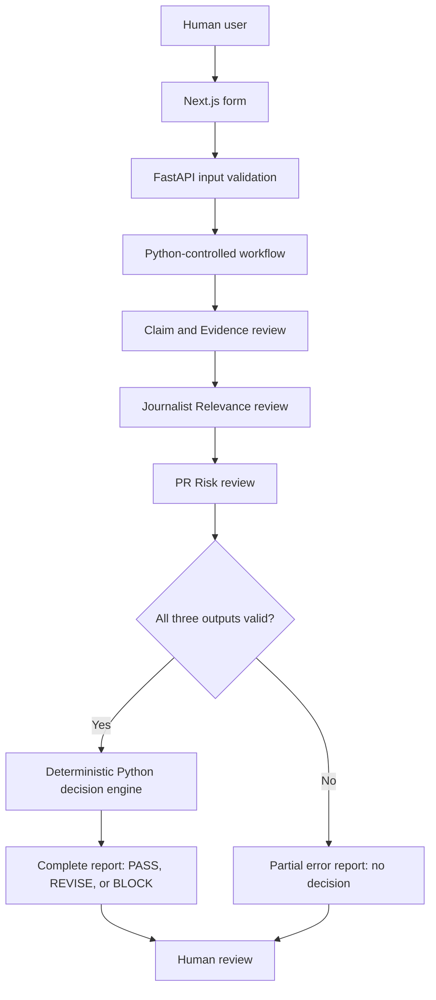

# PitchGuard

PitchGuard is an AI-assisted quality gate that reviews PR pitches before they are sent to journalists. It checks whether claims match supplied evidence, whether the journalist is a suitable target, and whether the pitch creates language, confidentiality, or reputational risks.

> **Current status:** **Implemented — MVP v0.1.0.** The complete local workflow, responsive frontend, FastAPI API, three AI reviewers, deterministic decision engine, failure handling, automated tests, fictional evaluation fixtures, and Docker Compose startup are present. PitchGuard is local-only and is not deployed.

## Overview

PitchGuard helps a PR professional review a draft before deciding whether to send it. The application accepts manually pasted campaign information, runs three focused reviewers through local Ollama, validates every reviewer response, and then uses Python rules to return `PASS`, `REVISE`, or `BLOCK`.

PitchGuard is a decision-support system. It does not contact journalists, independently prove facts, or guarantee that a pitch is safe or correct. A human remains responsible for the final decision.

## Problem

AI-assisted drafts can sound credible while still containing:

- unsupported, exaggerated, or contradicted claims;
- incorrect statistics, rankings, or comparisons;
- poor journalist targeting or generic personalization;
- overly promotional, manipulative, or spam-like language;
- unclear calls to action; or
- confidential, sensitive, or reputationally dangerous information.

Sending such a pitch can damage trust with a journalist and harm an agency or client.

## Solution

The implemented review accepts:

1. A company name, announcement, and target audience
2. Zero or more supporting evidence items
3. A journalist name, publication, and coverage focus
4. Zero or more recent-coverage examples
5. A draft PR pitch

Each AI reviewer returns structured JSON matching a Pydantic schema. The application also checks semantic rules, such as whether a referenced evidence ID exists and whether a quoted finding appears in the supplied pitch. Only a complete set of valid reviewer results can reach the deterministic decision engine.

The report contains:

- a final `PASS`, `REVISE`, or `BLOCK` recommendation for complete reviews;
- journalist relevance and personalization scores;
- supported, unsupported, contradicted, and unclear claim findings;
- tone, language, confidentiality, and reputational risk findings;
- human-readable explanations and recommended actions; and
- safe reviewer errors with any successful partial results when the analysis is incomplete.

## Demo and screenshots

**Implemented — local demo.** The responsive frontend contains the complete manual-input workflow and report view.

The fastest way to see the application is the Docker Compose option in [Getting started](#getting-started).

## How it works

1. The user opens the frontend.
2. The user enters campaign details and optional evidence.
3. The user enters the journalist profile and optional recent coverage.
4. The user pastes the draft pitch.
5. The user selects **Review pitch**.
6. The application displays a review-in-progress state while the reviewers run sequentially.
7. A complete analysis displays the deterministic decision and all findings.
8. An incomplete analysis displays no decision, explains the reviewer failures, and preserves successful partial results.
9. The user can edit the form and submit it again.
10. The user manually decides whether to use the pitch.

## Agent responsibilities

### 1. Claim and Evidence Agent — **Implemented**

This reviewer extracts factual and measurable statements, including statistics, comparisons, performance claims, and market-leadership claims. It compares each statement only with the supplied evidence and classifies it as:

- `SUPPORTED`
- `UNSUPPORTED`
- `CONTRADICTED`
- `UNCLEAR`

It explains every classification and references supplied evidence IDs when appropriate. General model knowledge is never accepted as proof of a campaign claim.

For example, if the pitch claims a 40% saving across all working time while the supplied study reports a 22% reduction for administrative tasks, the reviewer should identify the changed percentage and scope rather than treat the claims as equivalent.

### 2. Journalist Relevance Agent — **Implemented**

This reviewer compares the campaign with the journalist's supplied coverage focus and recent work. It returns:

- a relevance score from 0 to 100;
- a personalization score from 0 to 100;
- matched topics;
- specific mismatches;
- missing context; and
- a short explanation.

It cannot assume facts about the journalist that the user did not provide.

### 3. PR Risk Agent — **Implemented**

This reviewer looks for excessive promotion, unsupported superlatives, misleading certainty, spam-like pressure, unclear calls to action, confidentiality problems, and reputational risks. Each finding has a category, a `LOW`, `MEDIUM`, `HIGH`, or `CRITICAL` severity, an explanation, and a recommended action.

This reviewer reports risks but never selects the final decision.

## System architecture

The frontend and backend remain separate. The browser calls FastAPI, and only the Python backend communicates with Ollama. Each reviewer uses the same provider interface but has its own versioned prompt, request context, response schema, and semantic validation.

Reviewers run in the fixed order Claim and Evidence, Journalist Relevance, then PR Risk. Sequential execution reduces local-model contention on CPU-only machines. Expected operational failures do not stop later reviewers, so the API can preserve successful partial results.



## Decision and guardrail logic

**Implemented.** The AI reviewers identify and explain findings. Synchronous Python code owns the final decision, using the precedence `BLOCK > REVISE > PASS`.

`BLOCK` is returned when at least one of these conditions exists:

- a high-importance claim contradicts supplied evidence;
- a critical PR or reputational risk is present;
- a high or critical confidentiality risk is present; or
- journalist relevance is below 40.

`REVISE` is returned when there is no blocking condition and at least one of these conditions exists:

- a low- or medium-importance claim contradicts supplied evidence;
- a medium- or high-importance claim is unsupported or unclear;
- relevance is from 40 through 69;
- personalization is below 60;
- an actionable medium- or high-severity risk is present; or
- a reviewer reports missing context.

`PASS` is returned only when the workflow is complete and no blocking or revision condition exists. The thresholds live in the backend `DecisionPolicy` and have boundary tests for 39/40, 69/70, and 59/60.

The main guardrails are:

- **Human-in-the-loop:** the application advises; a person decides whether to send.
- **Structured output:** every model response is validated against a Pydantic schema.
- **Semantic validation:** structurally valid but inconsistent reviewer results are rejected.
- **Deterministic decisions:** no AI reviewer can select or override the final outcome.
- **Evidence-bounded analysis:** supplied evidence is distinct from unverified pitch content.
- **Fail-safe behavior:** invalid, missing, or timed-out analysis cannot produce a completed decision.
- **Explainability:** every important finding and decision reason is visible to the user.

## Technology stack

| Area | Current technology | Status |
| --- | --- | --- |
| Frontend | Next.js 16, React 19, TypeScript, Tailwind CSS 4 | **Implemented** |
| Backend | Python 3.14, FastAPI, Pydantic, Pydantic Settings | **Implemented** |
| Local AI | Ollama with configurable model, default `qwen3:4b` | **Implemented** |
| Backend tests | pytest and HTTP test clients | **Implemented** |
| Frontend tests | Vitest, React Testing Library, `user-event` | **Implemented** |
| Quality checks | Ruff, ESLint, TypeScript | **Implemented** |
| CI | GitHub Actions | **Implemented** |
| Packaging | Docker Compose and separate application images | **Implemented** |
| Storage | No permanent analysis storage | **Implemented scope decision** |

Resolved dependency versions are recorded in `backend/uv.lock` and `frontend/package-lock.json`.

## Current implementation status

| Capability | Status | Location |
| --- | --- | --- |
| Review form and complete/partial report UI | **Implemented** | `frontend/src/` |
| Health endpoint | **Implemented** | `GET /api/health` |
| Main review endpoint | **Implemented** | `POST /api/v1/reviews` |
| Three specialized reviewers | **Implemented** | `backend/app/reviewers/` |
| Versioned prompts | **Implemented** | `backend/app/prompts/templates/` |
| Ollama provider boundary | **Implemented** | `backend/app/providers/` |
| Sequential workflow and safe failures | **Implemented** | `backend/app/workflow/` |
| Deterministic decision engine | **Implemented** | `backend/app/decision/` |
| Automated backend and frontend tests | **Implemented** | `backend/tests/`, `frontend/src/**/*.test.tsx` |
| Deterministic evaluation fixtures | **Implemented** | `backend/tests/fixtures/evaluation/` |
| Fictional manual scenarios | **Implemented** | `manual-test-scenarios/` |
| Docker Compose startup | **Implemented** | `compose.yaml` |

## Getting started

### Fastest option: Docker Compose

This option does not require a separate Python, Node.js, or Ollama installation.

Prerequisites:

- Docker Desktop on Windows or macOS, or Docker Engine with Docker Compose on Linux
- Docker Desktop or Docker Engine started and ready before running the command
- Internet access on the first run for container and model downloads
- Enough free memory and disk space to run a local language model

From the repository root, the directory containing `compose.yaml`, run:

```bash
docker compose up --build
```

The first start takes longer because Docker downloads the images and Ollama downloads `qwen3:4b`. The model is then reused from the `ollama-data` Docker volume. Wait for the services to become healthy, then open `http://localhost:3000`.

Useful commands:

```bash
docker compose ps
docker compose logs -f ollama-model backend
docker compose down
```

If port 3000 or 8000 is already in use, select different host ports before starting.

PowerShell:

```powershell
$env:FRONTEND_PORT=3100
$env:BACKEND_PORT=8100
docker compose up --build
```

Bash, zsh, or Git Bash:

```bash
FRONTEND_PORT=3100 BACKEND_PORT=8100 docker compose up --build
```

Then open `http://localhost:3100`. The portable default uses CPU-compatible Ollama execution; GPU-specific configuration is not required.

### Native development prerequisites

- Python 3.14
- [uv](https://docs.astral.sh/uv/) for Python dependency management
- Node.js 24 and npm
- Ollama when running live reviews

Install the locked dependencies from the repository root:

```bash
cd backend
uv sync --locked --dev

cd ../frontend
npm ci
```

## Environment variables

The repository contains example files only. Local `.env` files are ignored by Git and must never contain committed secrets.

`backend/.env.example`:

```env
APP_ENV=development
OLLAMA_BASE_URL=http://localhost:11434
OLLAMA_MODEL=qwen3:4b
OLLAMA_TIMEOUT_SECONDS=360
CORS_ORIGINS=["http://localhost:3000"]
```

`frontend/.env.example`:

```env
NEXT_PUBLIC_API_BASE_URL=http://localhost:8000
```

The backend validates its settings during startup. The defaults support native local development; Docker Compose supplies the internal container addresses automatically.

### Native Ollama setup

Install and start Ollama, then download the default model:

```bash
ollama pull qwen3:4b
ollama list
```

The original `qwen3:8b` model exceeded the configured timeout when three reviews competed for CPU on the tested machine. The smaller `qwen3:4b` model and sequential workflow provide a more portable local demonstration. This is an operational choice, not a claim that the smaller model has better review quality.

## Running the application natively

Start the backend in one terminal:

```bash
cd backend
uv run uvicorn app.main:app --reload
```

After the API starts, `http://localhost:8000/api/health` should return:

```json
{
  "status": "ok",
  "service": "pitchguard-api"
}
```

Start the frontend in a second terminal:

```bash
cd frontend
npm run dev
```

Open `http://localhost:3000`.

## Running tests and checks

Backend:

```bash
cd backend
uv run ruff check .
uv run ruff format --check .
uv run pytest
```

Frontend:

```bash
cd frontend
npm run test
npm run lint
npm run typecheck
npm run build
```

Container configuration and builds:

```bash
docker compose config --quiet
docker compose build backend frontend
```

GitHub Actions runs these backend, frontend, and container checks for pushes to `main` and pull requests.

## Evaluation approach

### Deterministic evaluation — **Implemented**

Three fictional JSON cases validate the complete `PASS`, `REVISE`, and `BLOCK` paths. Mocked provider outputs still pass through the real reviewers, semantic validation, sequential workflow, and decision engine. Normal tests do not require Ollama or network access.

```bash
cd backend
uv run pytest tests/evaluation
```

The wider test suite covers:

- contradicted claims, unsupported claims, and decision boundaries;
- relevance and personalization thresholds;
- valid complete results and successful `PASS` behavior;
- malformed, empty, schema-invalid, and semantically invalid AI responses;
- connection failures, timeouts, server errors, and missing models;
- bounded retry behavior;
- partial-result preservation and safe `503` responses; and
- frontend payload, validation, complete report, and partial-error behavior.

Eight additional fictional examples in `manual-test-scenarios/` can be pasted into the UI to explore supported claims, weak personalization, contradiction, poor targeting, confidentiality, spam-like language, and prompt injection.

## Example analysis

> **Illustrative example only:** this is not a production result.

- **Decision:** `REVISE`
- **Journalist relevance:** 82/100
- **Personalization:** 45/100
- **Claims:** 2 supported, 1 unsupported
- **Highest risk:** Unsupported market-leadership claim
- **Recommended action:** Remove the unsupported claim and reference a supplied recent article by the journalist.

## Security and privacy considerations

- All campaign, evidence, journalist, coverage, and pitch fields are treated as untrusted input.
- Reviewer prompts tell the model not to follow instructions embedded in user-provided content.
- Reviewer outputs are schema-validated and semantically checked before use.
- Safe client errors exclude prompts, raw model output, pitch content, evidence content, environment values, internal response bodies, and stack traces.
- The application does not intentionally log full submitted content.
- Analyses are processed without permanent application storage.
- The default Ollama endpoint is local. If an operator changes `OLLAMA_BASE_URL` to a remote endpoint, the submitted review context will be sent to that endpoint.
- Real client data, personal information, credentials, and API keys must never be committed.

These controls reduce risk but do not replace legal review, source verification, editorial judgment, or organizational security policy.

## Known limitations

- LLM findings can be incomplete, inconsistent, or incorrect even when their JSON is valid.
- A `SUPPORTED` claim means it matches supplied evidence; it is not independently proven true.
- Relevance and tone remain contextual judgments requiring human review.
- The MVP is supported and evaluated in English only. Other Unicode text is accepted but untested; there is no language detection or translation.
- A request accepts at most 10 evidence items, 10 recent-coverage items, and a pitch from 50 to 6,000 characters. Other limits are recorded in `docs/project-decisions.md`.
- CPU-only live reviews can take several minutes and depend on the host's available memory and processing speed.
- Analyses do not have permanent storage.

## Project scope and future implementations

### MVP scope — **Implemented**

- Manual pasted-text inputs
- Three specialized AI reviews
- Structured and semantic output validation
- Fixed sequential orchestration
- Deterministic decision logic
- Complete and partial-error reports
- Fictional demonstration scenarios
- Automated tests for critical rules and failures
- Local native and Docker Compose startup

### Future Implementations

- Email, WhatsApp, or SMS delivery
- Journalist databases or web scraping
- Authentication, billing, or CRM features
- PDF or other file upload
- Long-term campaign storage
- Translation or language detection
- Cloud deployment
- Fully autonomous outreach

## Repository structure

```text
PitchGuard/
├── .agents/skills/
├── .github/workflows/
├── backend/
│   ├── app/
│   ├── tests/
│   ├── Dockerfile
│   ├── pyproject.toml
│   └── uv.lock
├── frontend/
│   ├── src/
│   ├── Dockerfile
│   ├── package.json
│   └── package-lock.json
├── docs/
├── evals/
├── fixtures/
├── manual-test-scenarios/
├── compose.yaml
├── AGENTS.md
├── LICENSE
└── README.md
```

## License

PitchGuard is available under the MIT License. See `LICENSE`.
